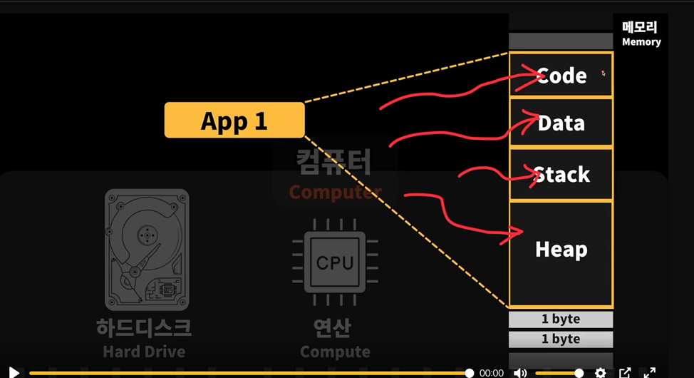
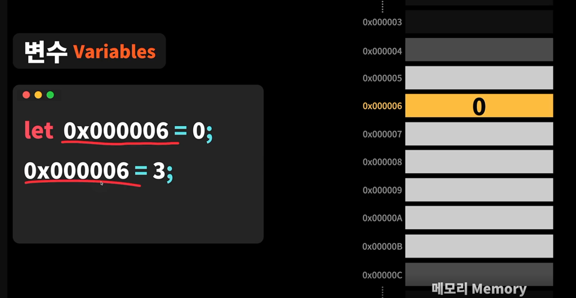
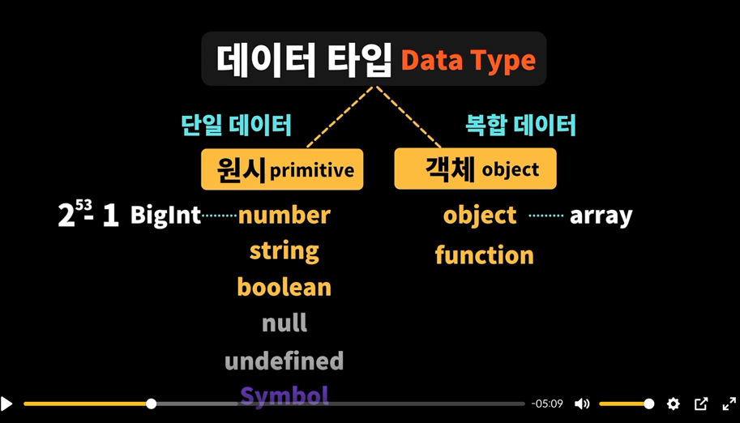
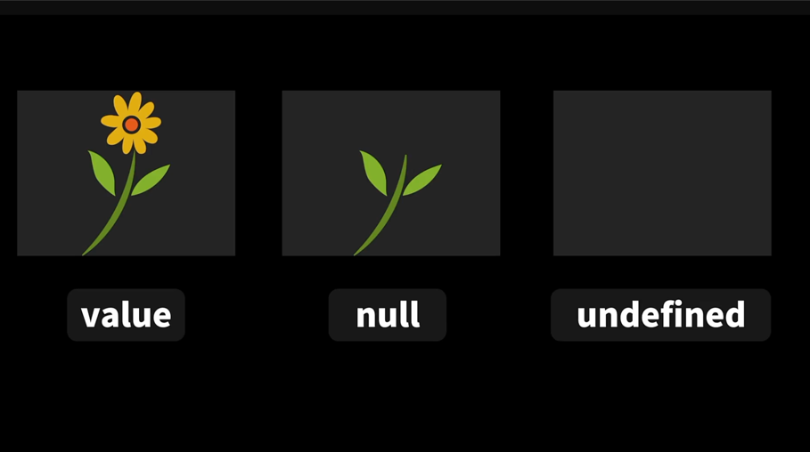
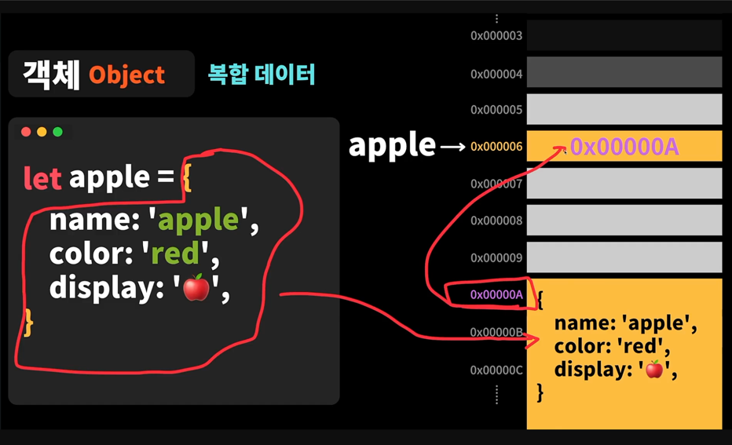
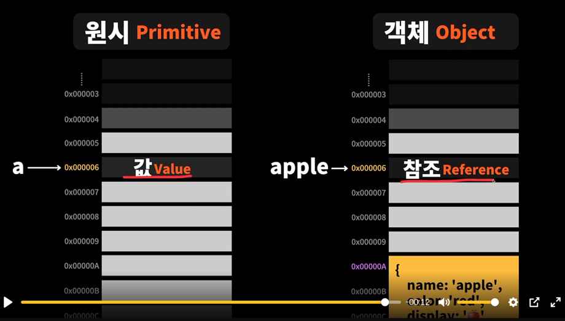
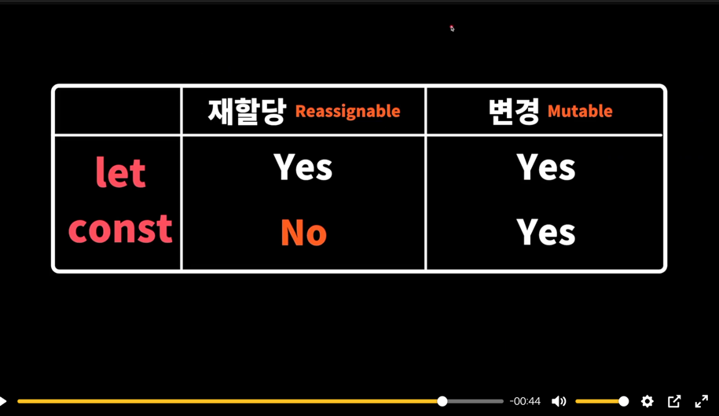

# 변수
***
## 메모리(Memory)
> 컴퓨터의 주요 구성요소는 하드디스크 Cpu Memory

에플리케이션이 실행될때마다 메모리를 할당해서 실행이 됩니다.
- APP 여러개 실행 시 사용하지 않는건 하드디스크에 저장 후 실행 
- APP 필요한 메모리보다 더 클 경우 에러 발생
### APP 실행 시 메모리의 구성

- Code : 개발자가 입력한 코드
- Data : 변수
- Stack : 실행 순서
- Heap : 객체
***
## 변수 선언 및 재할당
> 변수(variable)는 값을 저장하는 공간이며 자료를 저장할수 있는 이름이 주어진 기억장소를 말한다<br/>
> 변수는 메모리 주소 저장


```js
let a // 변수 선언
let b = 1 // 변수 할당
a = 2 // 변수 재할당
```
## 데이터 타입 

***
## Null undefined 차이

***
## 객체 저장 방식
> 객체는 Heap 공간에 저장되며 변수는 할당된 주소값을 저장합니다. 


***
## 값과 참조의 차이
> 원시타입은 값이 저장되지만 객체는 참조값(메모리주소)가 저장


***
## let const 
> 재할당은 불가능하지만 참조값안에 있는 내용 변경은 가능함


***
## JavaScript Type
> 자바스크립트는 타입이 정해져있으나 동적이며 약하게(데이터 할당된 값에 따라 변경) 정해진다.


