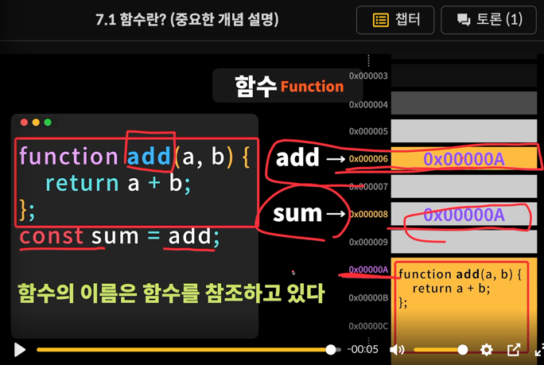

# 함수
***
## 함수 
> 특정한 일을 수행하는 코드의 집합

- 프로그램 상에서 중복되는 일이 있으면 함수로 정의 
- 함수명과 매개변수명도 의미있게 짓기
### 함수의 이름은 함수를 참조하고 있다(콜백함수의 중요 컨셉)

### 일급함수 (first-class function)
함수가 일반 객체처럼 모든 연산이 가능한 것
- 함수의 매개변수로 전달
- 함수의 반환값
- 할당 명령문
- 동일 비교 대상
### 고차함수 Higher-order function 
- 인자를 함수로 받거나 (콜백함수)
- 함수를 반환하는 함수를 고차함수

### 불변성 (Immutability)

